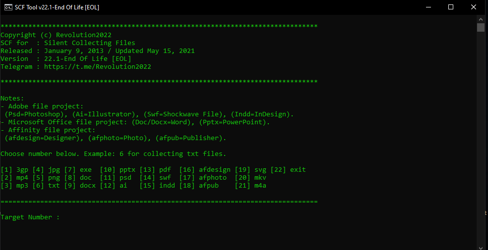

# SCFTool

Hello, I'm Farid Rid or better known as @Revolution2022 on Telegram.

SCF Tool is a Silent Collecting Files written with Batch Script as a hobby on January 9, 2013.

SCF Tool aims to collect several file formats that I have set just pressing the number button. 

After several years of updating the code, I hereby announce the SCF Tool source code to the public. It is good for everyone to use for personal or commercial improvement and use.

The final update was made on May 15, 2021 with version 22.1 and the project officially has been discontinued.

Any feedback via Telegram:
https://t.me/Revolution2022

Donate Ethereum (ETH):
0x2CbD8b2Da24492065F664a01529B5E3BFC8E2ae3

Donate Xelis (XEL):
xel:82mwzht462k2mehu6tp8g09kujmegwxm63tmes2yrxx25dj0nadsqqq7d8t

# System Requirements
* Windows NT and later
* WineHQ 5.0.x and later (Recommended 8.0)
* Intel / AMD Processor that supported Windows 7 and later
* 256MB RAM
* Intergrated GPU for accelerate processing
* 640 x 480 screen size

